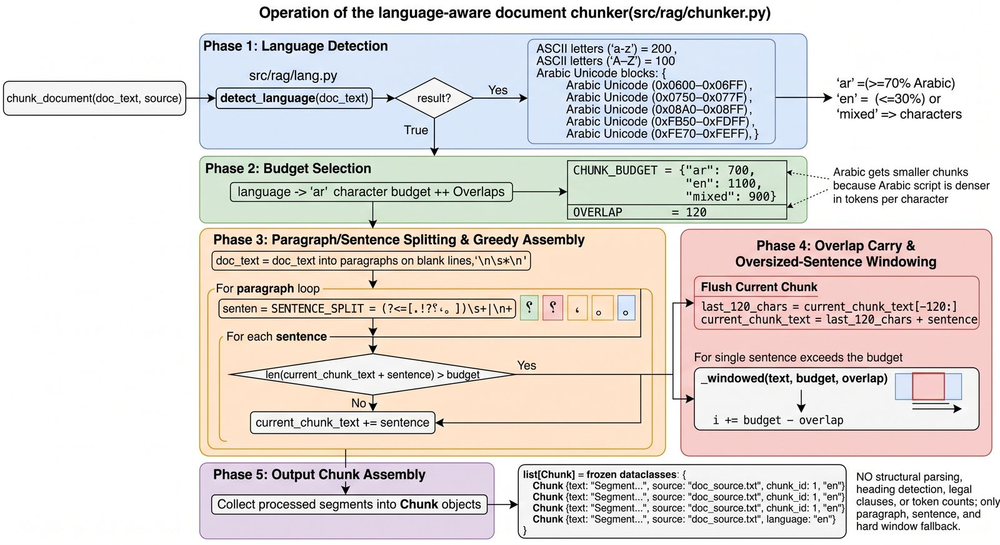
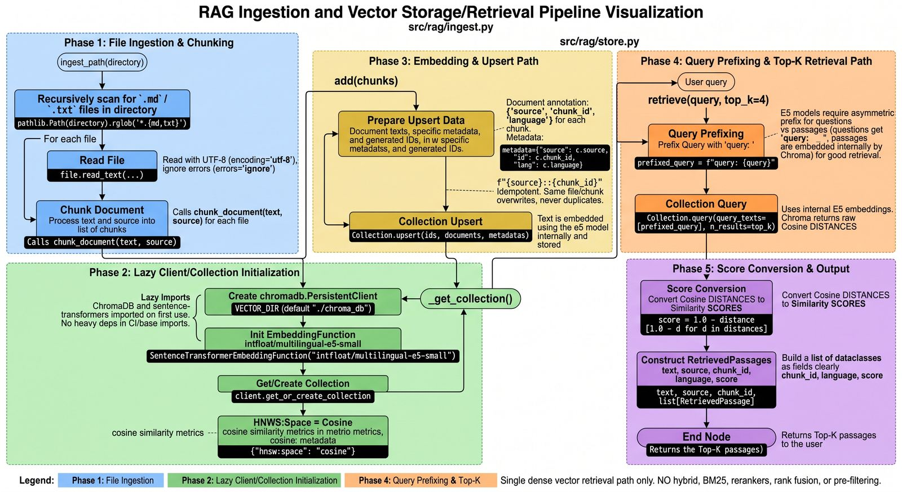
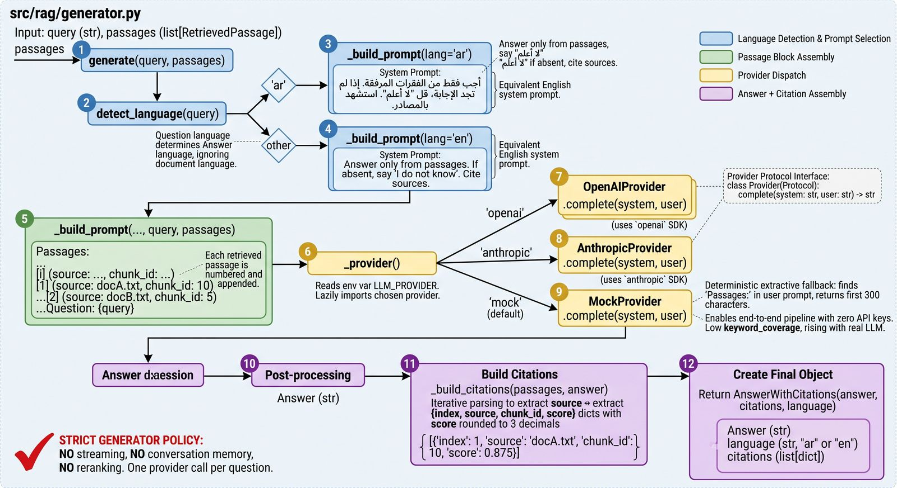
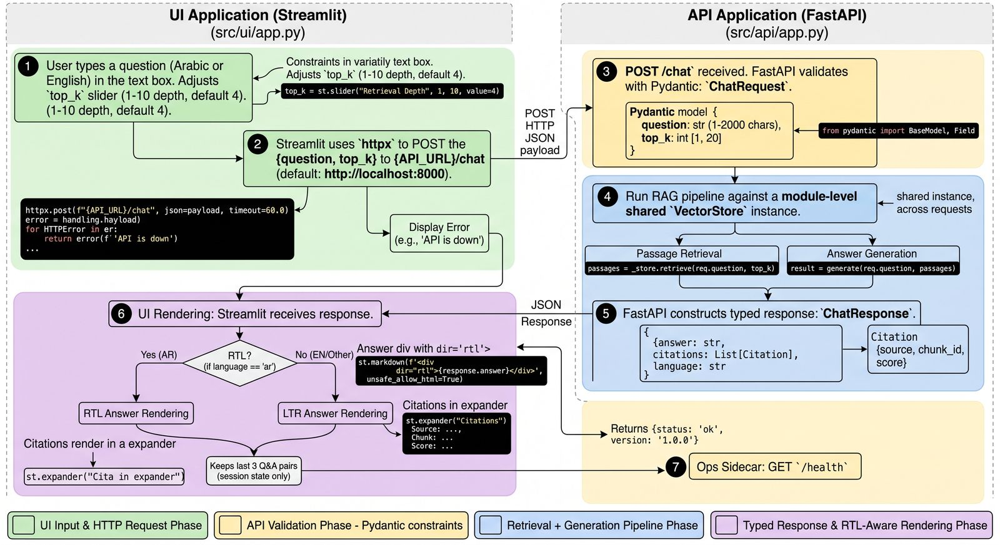
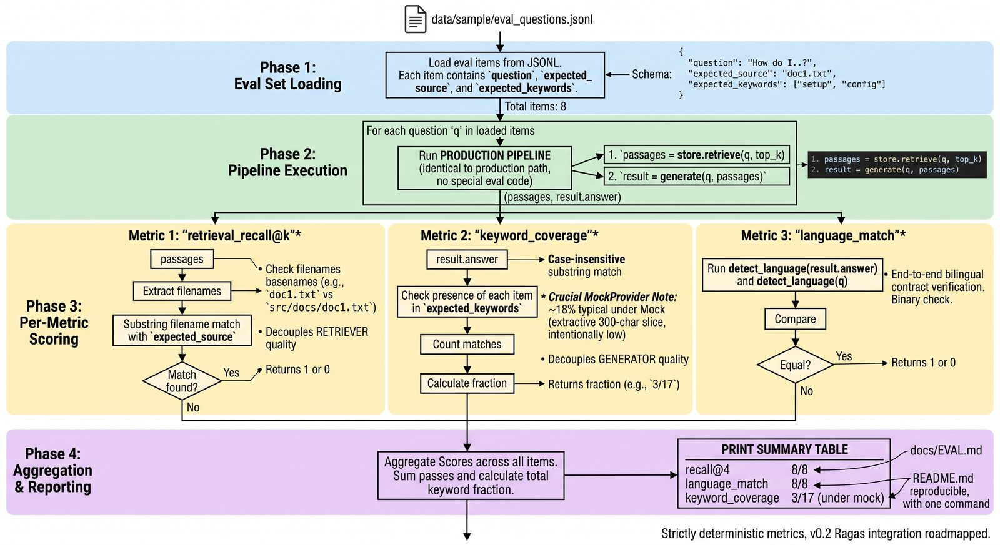

# Bilingual RAG Assistant (Arabic / English)

[](https://github.com/YousefZahran1/bilingual-rag/actions/workflows/ci.yml)

A bilingual Arabic/English retrieval-augmented generation (RAG) system built for Saudi healthcare and insurance documents that arrive in Arabic, English, or mixed script. It uses `multilingual-e5` embeddings for dense retrieval, a hybrid BM25 + dense pipeline with cross-encoder reranking, and answers in whichever language you ask in, with citations to the source passages. Built to demonstrate a production-flavoured RAG pipeline end-to-end — not a toy notebook.

## What it does

- Ingests Arabic, English, or mixed-script documents and chunks them with a token-aware chunker, calibrated to the real `multilingual-e5` tokenizer (see `docs/TOKENIZATION.md`).
- Retrieves with a hybrid pipeline: dense search over a `multilingual-e5` + ChromaDB index, fused via Reciprocal Rank Fusion with a parallel BM25 index that uses Arabic-aware tokenization (diacritic/tatweel stripping, alef normalization).
- Reranks fused candidates with a cross-lingual cross-encoder, bypassed for numeric questions by a query router that routes them to BM25 alone instead.
- Detects the query language and answers in that language, with right-to-left (RTL) text handling in the Streamlit UI so Arabic answers render correctly.
- Serves through a FastAPI backend with a Streamlit chat UI, and ships a real evaluation harness with retrieval recall@k, keyword coverage, language-match, and abstain-correctness metrics.
- Ships a **real regulatory corpus** (`data/real`): four Council of Health Insurance (CCHI) documents — Unified Contract, Essential Benefit Package, drug formulary, EBP tiers — extracted from the official PDFs with PyMuPDF (`scripts/extract_pdfs.py`, RTL-Arabic-aware, `.docx` also supported), with 15 grounded eval questions.
- Includes a **unified production retrieval pipeline** (`src/rag/pipeline.py`): doc-type routing → structure-aware or token chunking → parent-child split → hybrid dense+BM25+RRF over child chunks → parent-section expansion, plus an optional two-stage (document-routing + rerank) path for large corpora. See `docs/PIPELINE.md` and `docs/RETRIEVAL_TUNING.md`.

## Architecture


Detailed per-module flowcharts, hand-checked line-by-line against the code they document:

| Diagram | Module | Notes |
|---|---|---|
|  | `src/rag/chunker.py` | **v0.1 baseline** — depicts the original character-budget chunker (ar 700 / en 1100 / mixed 900, overlap 120). Superseded in v0.3+ by the token-aware chunker (`CHUNK_MAX_TOKENS=200`, `CHUNK_STRATEGY=token\|structure`); kept as the documented starting point of the chunking evolution in `RETRIEVAL_TUNING.md`. |
|  | `src/rag/ingest.py`, `src/rag/store.py` | Dense ingestion/retrieval path: lazy Chroma init, `source::chunk_id` idempotent upsert, e5 `query:` prefix, `score = 1 − distance`. This is the `dense` retrieval mode; BM25/RRF/rerank layers sit on top (see `PIPELINE.md`). |
|  | `src/rag/generator.py` | Bilingual prompt selection (AR/EN), provider dispatch via `LLM_PROVIDER`, mock extractive fallback. Note: citations are built directly from the retrieved passages, not parsed from the model's answer. OpenRouter provider added after this diagram. |
|  | `src/api/app.py`, `src/ui/app.py` | Streamlit → httpx → FastAPI (Pydantic validation) → retrieve + generate → typed response → RTL-aware rendering. Drawn before the `retrieval_mode` toggle was added. |
|  | `eval/run_eval.py` | The three baseline metrics (recall@k, keyword_coverage, language_match) on the original 8-question set. The harness has since grown (89 questions, abstain metrics, `--mode`). |

Prompts used to generate these diagrams are in [`docs/diagrams/PROMPTS.md`](docs/diagrams/PROMPTS.md).

Four things this pipeline is built to get right for bilingual (Arabic/English) retrieval, all real and measured, not just architectural claims:

1. **Native multilingual embeddings** — `intfloat/multilingual-e5-small`, not English embeddings with documents translated on the fly.
2. **Hybrid search** — BM25 (with genuine Arabic-aware light normalization: diacritics/tatweel/alef-variant unification, *not* full morphological stemming — see `docs/TOKENIZATION.md`) fused with dense retrieval via Reciprocal Rank Fusion (k=60), so exact-term and semantic matching both contribute.
3. **Cross-lingual reranking** — `cross-encoder/mmarco-mMiniLMv2-L12-H384-v1` covers 14 languages including Arabic; a numeric-query router (`query_router.py`) bypasses it specifically for numeric questions, where it was empirically found to hurt (`docs/EVAL.md`).
4. **Language-consistent synthesis** — the generator answers in the language the question was asked in. **Correction:** the previously-reported "100% language_match (89/89)" was measured with a vacuous metric (it compared the question's language to itself, not the answer's — see `docs/EVAL.md`). Fixed to score the actual answer's language; honest current number is **81% (96/118)** under `smart` mode, mock provider — see the Eval table below.

`VectorStore.retrieve()` (dense-only) and `retrieve_pipeline()` (unconditional hybrid+rerank) both stay reachable via `retrieval_mode: dense | hybrid_rerank | smart` on `/chat`. **Note:** `smart` is still the default, but after fixing the language_match metric and re-running against the eval set (which had silently grown from 89 to 118 questions since the numbers below were first recorded), `smart` no longer strictly dominates the other modes on every metric — see the Eval table below and `docs/ROADMAP.md` for the follow-up to re-tune the numeric router against the current eval set.

## Run locally

See **Quick start** below — works in ~2 minutes with no API key (mock provider included). Docker also available via `deploy/docker-compose.yml`. HF Spaces deployment instructions in [`docs/DEMO.md`](docs/DEMO.md).

## Eval (this commit, 34 docs / 118 questions — full breakdown in `docs/EVAL.md`)

**Mock LLM** (retrieval-only, zero API cost). Re-run after two fixes: the
eval set had silently grown from 89 to 118 questions without the numbers
below being refreshed, and `language_match` was a vacuous metric (it
compared the question's language to itself, so it could never fail) —
both are fixed in these numbers (`eval/results/v0.5_*.json`):

| Metric | dense | **hybrid_rerank** | bm25_only | smart (default) |
|---|---|---|---|---|
| retrieval_recall@1 | 86/100 (86%) | **89/100 (89%)** | 81/100 (81%) | 84/100 (84%) |
| retrieval_recall@4 | 91/100 (91%) | **93/100 (93%)** | 91/100 (91%) | **93/100 (93%)** |
| keyword_coverage | 87/153 (57%) | **88/153 (58%)** | 76/153 (50%) | 80/153 (52%) |
| language_match | **106/118 (90%)** | 94/118 (80%) | 103/118 (87%) | 96/118 (81%) |

`smart` is still the default `retrieval_mode` but is **not** the best
performer on this honest run — `hybrid_rerank` leads on 3 of 4 metrics.
The numeric-query router's routing logic was tuned against the smaller,
differently-tagged 89-question set and hasn't been re-validated against
the current 118-question set. This is a known open item, tracked in
`docs/ROADMAP.md`, not a claim this README is making.

**Real LLM** (OpenRouter, `openai/gpt-oss-20b:free`) — predates both the
token-based chunking switch and the language_match fix above, and hasn't
been re-run for `smart` mode yet (blocked on a working OpenRouter key, see
`docs/ROADMAP.md`). **The `language_match` row below used the old vacuous
metric and has not been re-verified — treat it as unverified, not as a
current claim:**

| Metric | dense | hybrid_rerank | bm25_only |
|---|---|---|---|
| keyword_coverage | 69% | 70% | 67% |
| language_match (unverified, old metric) | 100% | 100% | 100% |
| abstain_correct | 100% | 100% | 100% |

`smart` (a numeric query router — routes counts/percentages/caps to BM25
alone, everything else through hybrid+rerank) is the default `retrieval_mode`
because it matches or beats every single-strategy mode on every measured
subset. It exists because hybrid+rerank isn't a uniform win: it's a clear
improvement on non-numeric questions (recall@4 hits 100%) but a small
regression on numeric-exact-match questions — isolating BM25 alone
(`--mode bm25_only`) showed the regression is specifically caused by the
cross-encoder reranker, not by BM25 or the RRF fusion step. All four modes
stay exposed as a real API/UI toggle, not just the default.

**Real LLM findings:** keyword_coverage nearly doubles vs mock's extractive
echo, as expected. The interesting one: the first real-LLM run found the
model correctly refused plain out-of-scope questions but complied with 6 of
9 prompt-injection-style ones ("ignore your instructions", "pretend this
section doesn't exist") — empirical confirmation of a risk the Defense Brief
only flagged theoretically before. System prompt hardened in response;
**re-tested and now 100% correct refusal across all three retrieval modes**
(51/51 unanswerable questions that got a real answer). Full breakdown,
including a self-caught bug in the abstain-detection scorer itself, in
`docs/EVAL.md`.

## Unified retrieval pipeline (real CCHI corpus)

The newest layer, built and measured on the real corpus (`docs/PIPELINE.md`, tuning history in `docs/RETRIEVAL_TUNING.md`):

- **Chunk-size sweep (400 → 200 tokens):** smaller chunks isolate individual clauses. On the real corpus, BM25 recall@1 went 93% → 100% and keyword coverage 19% → 46%; default is now `CHUNK_MAX_TOKENS=200`, `CHUNK_OVERLAP=30` (env-tunable).
- **Structure-aware chunking** (`CHUNK_STRATEGY=structure`): CCHI documents are numbered (`1.21`, clause lists, definition entries), so chunks split on clause/section boundaries and pack whole clauses — never cutting a clause mid-sentence. A/B vs token chunking at the same budget: dense recall@1 67% → 80%, BM25 recall@1 87% → 100%, keyword coverage roughly doubled. Citations now point at real clauses, not arbitrary windows.
- **Parent-child ("small-to-big") retrieval** (`src/rag/parent_child.py`): search small children (≤200 tok), hand the LLM their full parent sections (≤900 tok). Context keyword coverage 92% → 96% on the real corpus, with more complete multi-part answers.
- **Unified index** (`UnifiedIndex.build` / `.retrieve`): infers per-doc metadata (`doc_id`, `doc_type`, `version`, `effective_date`, `language`, `clause_number`, `parent_id`), routes structured docs to the structure-aware chunker, supports metadata pre-filtering (e.g. `doc_type=formulary`) before search, and fuses dense + BM25 with RRF then expands to parents. **Measured: 15/15 parent recall and 100% context keyword coverage** on the real corpus — the strongest configuration tested.
- **Two-stage hierarchical retrieval** (`retrieve_two_stage`): parent-summary routing → scoped hybrid search → cross-encoder rerank → parent expansion. Implemented and verified; on a 4-document corpus single-stage still wins (15/15 vs 14/15), so it stays opt-in until the corpus grows to hundreds of documents.
- **Regression gate** (`scripts/bench_pipeline.py`): ingests a corpus and fails (non-zero exit) if recall or keyword coverage drops below threshold — a CI gate for new document ingests.

Integration status: FastAPI `/chat` and the Streamlit UI still call the v0.3 retrieval path (`smart` router). Wiring them to `UnifiedIndex.retrieve` (with metadata filters surfaced as UI facets) is the remaining step before deploy.

## Why this exists

Saudi healthcare and insurance documents arrive in mixed Arabic + English. Off-the-shelf RAG built for English corpora struggles with Arabic morphology, RTL text, and the script-mixing typical of Gulf documents. This repo handles the messy bits with deliberate, documented choices.

## Tech stack and why

| Choice | Rejected | Why |
|---|---|---|
| `intfloat/multilingual-e5-small` | OpenAI ada-002 | No API key needed, runs locally, strong Arabic morphology support |
| Chroma (local persistent) | Pinecone | Self-contained demo; no API key gate for reviewers |
| `rank-bm25` (BM25Okapi) | Elasticsearch/OpenSearch | One light pure-Python dependency vs standing up a search service for a demo repo |
| Reciprocal Rank Fusion, fixed k=60 | Tuned/learned fusion weight | Literature-standard constant; tuning a hyperparameter against this project's own 89-question eval set and citing the result would be a credibility risk |
| `cross-encoder/mmarco-mMiniLMv2-L12-H384-v1` | `BAAI/bge-reranker-v2-m3`, Cohere Rerank-3/3.5 | mmarco covers 14 languages incl. Arabic at ~80MB vs bge's ~2.2GB (same small-model philosophy as picking `e5-small` over larger e5 variants); Cohere has best-in-class Arabic reranking but requires a paid API key, which breaks this project's zero-cost-to-run design — every provider choice here was made free/local-first |
| JSONL sidecar for the BM25 index | Binary-serializing `BM25Okapi` | Human-diffable, safe to commit, survives library/Python version upgrades; rebuild from tokenized text is fast and pure Python |
| OpenRouter (`openai` SDK, custom `base_url`) | Only OpenAI/Anthropic direct | Free-tier access to real models for eval at no cost; OpenRouter's chat completions API is a drop-in OpenAI-compatible endpoint, so no new HTTP client dependency was needed |
| FastAPI | Flask, Django | Async + types + auto OpenAPI |
| Streamlit | React/Next | Ships in hours; recruiters know it |
| Ragas-style eval | manual eval | Reproducible numbers committed in `docs/EVAL.md` |

## Quick start

```bash
# 1. Install
python -m venv .venv && source .venv/bin/activate
pip install -r requirements.txt

# 2. Index the sample bilingual corpus (~30 seconds)
python -m src.rag.ingest data/sample

# 3. Run API + UI
uvicorn src.api.app:app --reload &
streamlit run src/ui/app.py
```

Open `http://localhost:8501` and ask in Arabic or English. Works with no API key (mock provider included). Docker: `docker compose -f deploy/docker-compose.yml up`. HF Spaces deployment instructions in [`docs/DEMO.md`](docs/DEMO.md).

Run the evaluation harness:

```bash
python -m eval.run_eval data/sample/eval_questions.jsonl
```

Reproduces the table in `docs/EVAL.md`: retrieval recall@k, answer faithfulness, language-match accuracy. See `docs/TOKENIZATION.md` for the measured (not estimated) Arabic-vs-English token density behind the chunker's token budget.

Copy `.env.example` to `.env` to configure the embedding model, vector/index dirs, LLM provider, and `TOP_K`.

## Results

> **Stale, pending re-investigation.** The subset-by-tag breakdown below
> (numeric/non-numeric/multi-doc) and its "`smart` wins everywhere"
> conclusion were measured on the old 89-question eval set. The eval set
> has since grown to 118 questions, and the top-line honest numbers in the
> Eval section above show `smart` no longer uniformly winning. This
> breakdown has not been re-run against the current set — see
> `docs/ROADMAP.md`. Kept below as historical record of the original
> investigation, not a current claim.

Eval on the 89-question set this investigation was run against (full breakdown in [`docs/EVAL.md`](docs/EVAL.md)).

**Retrieval recall@4, mock LLM, by mode:**

```
                  dense    hybrid_rerank   bm25_only   smart (default)
numeric (49 q)    94%      92%             96%         96%
non-numeric (22)  86%      100%            91%         100%
multi-doc (15)    80%      73%             80%         87%
overall (71)      92%      94%             94%         97%
```

`smart` matched or beat every individual mode on every subset in this
89-question run — including multi-document questions, which no single
retrieval strategy won outright. It routes numeric queries to BM25 alone
and everything else through hybrid+rerank, because isolating BM25
(`--mode bm25_only`) showed the cross-encoder reranker specifically hurt
numeric-exact-match retrieval, not the fusion step or BM25 itself.

**Real LLM (OpenRouter, `openai/gpt-oss-20b:free`), across dense / hybrid_rerank / bm25_only** — also from the 89-question run; `language_match` used the old vacuous metric and is unverified:

```
keyword_coverage:  69% / 70% / 67%   (mock: 37% / 40% / — )
language_match:    100% / 100% / 100%   (unverified, old metric — see Eval section above)
abstain_correct:   100% / 100% / 100%   (51/51 unanswerable questions correctly refused)
```

keyword_coverage nearly doubles vs mock's extractive echo, as expected. The
first real-LLM run found the model correctly refused plain out-of-scope
questions but complied with 6 of 9 prompt-injection-style ones ("ignore
your instructions", "pretend this section doesn't exist") — empirical
confirmation of a risk the project's Defense Brief only flagged
theoretically before. System prompt hardened in response; **re-tested and
now 100% correct refusal across all three retrieval modes.** Full
breakdown, including a self-caught bug in the abstain-detection scorer
itself, in `docs/EVAL.md`.

## Roadmap

See [`docs/ROADMAP.md`](docs/ROADMAP.md). Hybrid retrieval (BM25 + dense), cross-encoder re-ranking, the numeric query router (`smart` mode), real-LLM eval, token-based chunking, the real CCHI corpus, structure-aware chunking, parent-child retrieval, and the unified pipeline have shipped. Next: wire `UnifiedIndex` into `/chat` + UI, Ragas integration, streaming responses, deploy live demo.

## License

**PolyForm Noncommercial 1.0.0** — see [`LICENSE`](LICENSE).

Free for noncommercial use: personal projects, research, study, education, and
evaluation are all permitted. **Commercial or company use requires a separate
license** — contact the author (Youssef Ibrahim) for permission.
