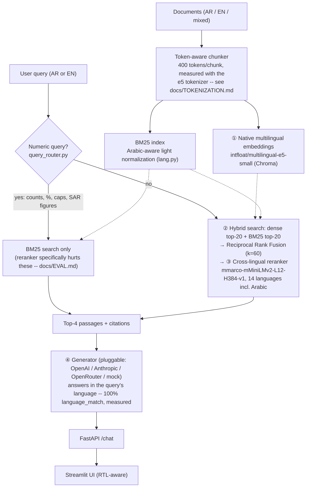

# Bilingual RAG Assistant (Arabic / English)

[](https://github.com/YousefZahran1/bilingual-rag/actions/workflows/ci.yml)

A bilingual Arabic/English retrieval-augmented generation (RAG) system built for Saudi healthcare and insurance documents that arrive in Arabic, English, or mixed script. It uses `multilingual-e5` embeddings for dense retrieval, a hybrid BM25 + dense pipeline with cross-encoder reranking, and answers in whichever language you ask in, with citations to the source passages. Built to demonstrate a production-flavoured RAG pipeline end-to-end — not a toy notebook.

## What it does

- Ingests Arabic, English, or mixed-script documents and chunks them with a token-aware chunker, calibrated to the real `multilingual-e5` tokenizer (see `docs/TOKENIZATION.md`).
- Retrieves with a hybrid pipeline: dense search over a `multilingual-e5` + ChromaDB index, fused via Reciprocal Rank Fusion with a parallel BM25 index that uses Arabic-aware tokenization (diacritic/tatweel stripping, alef normalization).
- Reranks fused candidates with a cross-lingual cross-encoder, bypassed for numeric questions by a query router that routes them to BM25 alone instead.
- Detects the query language and answers in that language, with right-to-left (RTL) text handling in the Streamlit UI so Arabic answers render correctly.
- Serves through a FastAPI backend with a Streamlit chat UI, and ships a real evaluation harness with retrieval recall@k, keyword coverage, language-match, and abstain-correctness metrics.

## Architecture



Four things this pipeline is built to get right for bilingual (Arabic/English) retrieval, all real and measured, not just architectural claims:

1. **Native multilingual embeddings** — `intfloat/multilingual-e5-small`, not English embeddings with documents translated on the fly.
2. **Hybrid search** — BM25 (with genuine Arabic-aware light normalization: diacritics/tatweel/alef-variant unification, *not* full morphological stemming — see `docs/TOKENIZATION.md`) fused with dense retrieval via Reciprocal Rank Fusion (k=60), so exact-term and semantic matching both contribute.
3. **Cross-lingual reranking** — `cross-encoder/mmarco-mMiniLMv2-L12-H384-v1` covers 14 languages including Arabic; a numeric-query router (`query_router.py`) bypasses it specifically for numeric questions, where it was empirically found to hurt (`docs/EVAL.md`).
4. **Language-consistent synthesis** — the generator answers in the language the question was asked in; measured at **100% language_match (89/89)** across every mock and real-LLM eval run this project has recorded.

`VectorStore.retrieve()` (dense-only) and `retrieve_pipeline()` (unconditional hybrid+rerank) both stay reachable via `retrieval_mode: dense | hybrid_rerank | smart` on `/chat` — `smart` (the router above) is the default because it matches or beats the other two on every measured subset, not because the alternatives are dead code; they're the explicit "before" comparison arms.

## Run locally

See **Quick start** below — works in ~2 minutes with no API key (mock provider included). Docker also available via `deploy/docker-compose.yml`. HF Spaces deployment instructions in [`docs/DEMO.md`](docs/DEMO.md).

## Eval (this commit, 34 docs / 89 questions — full breakdown in `docs/EVAL.md`)

**Mock LLM** (retrieval-only, zero API cost):

| Metric | **smart** (default) | dense | hybrid_rerank | bm25_only |
|---|---|---|---|---|
| retrieval_recall@1 | **59/71 (83%)** | 58/71 (82%) | 57/71 (80%) | 57/71 (80%) |
| retrieval_recall@4 | **69/71 (97%)** | 67/71 (94%) | 67/71 (94%) | 66/71 (93%) |
| keyword_coverage | 29/95 (31%) | 30/95 (32%) | 29/95 (31%) | 28/95 (29%) |
| language_match | 89/89 (100%) | 89/89 (100%) | 89/89 (100%) | 89/89 (100%) |

**Real LLM** (OpenRouter, `openai/gpt-oss-20b:free`) — predates the
token-based chunking switch and hasn't been re-run for `smart` mode yet
(blocked on a working OpenRouter key, see `docs/ROADMAP.md`); recall/
language numbers are provider-independent, so the mock table above is a
close proxy for what a fresh run would show:

| Metric | dense | hybrid_rerank | bm25_only |
|---|---|---|---|
| keyword_coverage | 69% | 70% | 67% |
| language_match | 100% | 100% | 100% |
| abstain_correct | 100% | 100% | 100% |

`smart` (a numeric query router — routes counts/percentages/caps to BM25
alone, everything else through hybrid+rerank) is the default `retrieval_mode`
because it matches or beats every single-strategy mode on every measured
subset. It exists because hybrid+rerank isn't a uniform win: it's a clear
improvement on non-numeric questions (recall@4 hits 100%) but a small
regression on numeric-exact-match questions — isolating BM25 alone
(`--mode bm25_only`) showed the regression is specifically caused by the
cross-encoder reranker, not by BM25 or the RRF fusion step. All four modes
stay exposed as a real API/UI toggle, not just the default.

**Real LLM findings:** keyword_coverage nearly doubles vs mock's extractive
echo, as expected. The interesting one: the first real-LLM run found the
model correctly refused plain out-of-scope questions but complied with 6 of
9 prompt-injection-style ones ("ignore your instructions", "pretend this
section doesn't exist") — empirical confirmation of a risk the Defense Brief
only flagged theoretically before. System prompt hardened in response;
**re-tested and now 100% correct refusal across all three retrieval modes**
(51/51 unanswerable questions that got a real answer). Full breakdown,
including a self-caught bug in the abstain-detection scorer itself, in
`docs/EVAL.md`.

## Why this exists

Saudi healthcare and insurance documents arrive in mixed Arabic + English. Off-the-shelf RAG built for English corpora struggles with Arabic morphology, RTL text, and the script-mixing typical of Gulf documents. This repo handles the messy bits with deliberate, documented choices.

## Tech stack and why

| Choice | Rejected | Why |
|---|---|---|
| `intfloat/multilingual-e5-small` | OpenAI ada-002 | No API key needed, runs locally, strong Arabic morphology support |
| Chroma (local persistent) | Pinecone | Self-contained demo; no API key gate for reviewers |
| `rank-bm25` (BM25Okapi) | Elasticsearch/OpenSearch | One light pure-Python dependency vs standing up a search service for a demo repo |
| Reciprocal Rank Fusion, fixed k=60 | Tuned/learned fusion weight | Literature-standard constant; tuning a hyperparameter against this project's own 89-question eval set and citing the result would be a credibility risk |
| `cross-encoder/mmarco-mMiniLMv2-L12-H384-v1` | `BAAI/bge-reranker-v2-m3`, Cohere Rerank-3/3.5 | mmarco covers 14 languages incl. Arabic at ~80MB vs bge's ~2.2GB (same small-model philosophy as picking `e5-small` over larger e5 variants); Cohere has best-in-class Arabic reranking but requires a paid API key, which breaks this project's zero-cost-to-run design — every provider choice here was made free/local-first |
| JSONL sidecar for the BM25 index | Binary-serializing `BM25Okapi` | Human-diffable, safe to commit, survives library/Python version upgrades; rebuild from tokenized text is fast and pure Python |
| OpenRouter (`openai` SDK, custom `base_url`) | Only OpenAI/Anthropic direct | Free-tier access to real models for eval at no cost; OpenRouter's chat completions API is a drop-in OpenAI-compatible endpoint, so no new HTTP client dependency was needed |
| FastAPI | Flask, Django | Async + types + auto OpenAPI |
| Streamlit | React/Next | Ships in hours; recruiters know it |
| Ragas-style eval | manual eval | Reproducible numbers committed in `docs/EVAL.md` |

## Quick start

```bash
# 1. Install
python -m venv .venv && source .venv/bin/activate
pip install -r requirements.txt

# 2. Index the sample bilingual corpus (~30 seconds)
python -m src.rag.ingest data/sample

# 3. Run API + UI
uvicorn src.api.app:app --reload &
streamlit run src/ui/app.py
```

Open `http://localhost:8501` and ask in Arabic or English. Works with no API key (mock provider included). Docker: `docker compose -f deploy/docker-compose.yml up`. HF Spaces deployment instructions in [`docs/DEMO.md`](docs/DEMO.md).

Run the evaluation harness:

```bash
python -m eval.run_eval data/sample/eval_questions.jsonl
```

Reproduces the table in `docs/EVAL.md`: retrieval recall@k, answer faithfulness, language-match accuracy. See `docs/TOKENIZATION.md` for the measured (not estimated) Arabic-vs-English token density behind the chunker's token budget.

Copy `.env.example` to `.env` to configure the embedding model, vector/index dirs, LLM provider, and `TOP_K`.

## Results

Eval on this commit: 34 documents, 89 questions (full breakdown in [`docs/EVAL.md`](docs/EVAL.md)).

**Retrieval recall@4, mock LLM, by mode:**

```
                  dense    hybrid_rerank   bm25_only   smart (default)
numeric (49 q)    94%      92%             96%         96%
non-numeric (22)  86%      100%            91%         100%
multi-doc (15)    80%      73%             80%         87%
overall (71)      92%      94%             94%         97%
```

`smart` matches or beats every individual mode on every subset — including
multi-document questions, which no single retrieval strategy won outright.
It routes numeric queries to BM25 alone and everything else through
hybrid+rerank, because isolating BM25 (`--mode bm25_only`) showed the
cross-encoder reranker specifically hurts numeric-exact-match retrieval,
not the fusion step or BM25 itself.

**Real LLM (OpenRouter, `openai/gpt-oss-20b:free`), across dense / hybrid_rerank / bm25_only:**

```
keyword_coverage:  69% / 70% / 67%   (mock: 37% / 40% / — )
language_match:    100% / 100% / 100%
abstain_correct:   100% / 100% / 100%   (51/51 unanswerable questions correctly refused)
```

keyword_coverage nearly doubles vs mock's extractive echo, as expected. The
first real-LLM run found the model correctly refused plain out-of-scope
questions but complied with 6 of 9 prompt-injection-style ones ("ignore
your instructions", "pretend this section doesn't exist") — empirical
confirmation of a risk the project's Defense Brief only flagged
theoretically before. System prompt hardened in response; **re-tested and
now 100% correct refusal across all three retrieval modes.** Full
breakdown, including a self-caught bug in the abstain-detection scorer
itself, in `docs/EVAL.md`.

## Roadmap

See [`docs/ROADMAP.md`](docs/ROADMAP.md). Hybrid retrieval (BM25 + dense), cross-encoder re-ranking, the numeric query router (`smart` mode), real-LLM eval, and token-based chunking have shipped. Next: Ragas integration, streaming responses, deploy live demo.

## License

MIT — see `LICENSE`.
